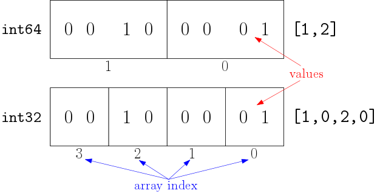

# Python is Slow

Python lists are very flexible and versatile. A list can contain any
types of objects, items can be added into a list, and items can be
removed. This flexibility, however, comes at a price: the Python lists
are not particularly suitable for storing and computing large amount of
numbers.

The reason for this is mainly due to how computer processors work. Each
element in a python list just like any other python variable, only
refers to the object it is currently associated with. In other words,
the python list elements only store the memory addresses of the objects
they represent. This offers great flexibility and memory efficiency, but
when the processor tries to load the data assocaited with the list into
its caches for computation it cannot get all the values they need in one
go.

Suppose we are summing up to every memeber of a list (`mylist`):

``` python
mylist = [1,2,3,4,5,6,7,8,9]
result = sum(mylist)
```

The CPU will try to load mylist from the main memory to a very fast
internal temporary storage area inside the CPU itself called the cache.
It will try to perform compute the final result from the data in cache,
and if the data in cache is not sufficient, then it will then dump the
cache and get more from the main memory. The computational efficiency
largely depends on how less often the cache is refreshed and data
reloaded from the main memory.

Now, a python list contains only references to the actual elements
stored in memory. Those elements can be at any parts of the main memory.
There is no requirement for them to be next to each other. When the list
is loaded into the cache, CPU will try to load all data of the list into
the cache, but during computation it quickly realises that the list data
do not contain the actual elements, only the references. It needs to
load the elements from other locations. So the cache is dumped and a
block of data containing the first element is loaded. But because the
first element and second element do not have to be near each other in
the main memory, the cache may have to be dumped again to load the
second element, and third and so on. This leads to very inefficient use
of cache and causes the computation to be slow.

The solution to this problem is to store the actual values of all the
elements of the list in one continuous block of memory, so that the
cache can obtain as many elements as possible in one load operation.
This leads to less frequent cache refreshes and thus more efficient
computation. The requirement for a different way of storing the list is
the main reason why `numpy` was introduced.

`numpy` arrays store their elements (not the references) directly in one
continuous block of memory. This is how arrays in C are stored. However,
because the array directly store the values and array elements must be
of the same size, hence elements must be of the same type. And as the
data is one continuous memory block, unlike python lists, one cannot
insert, add or remove elements from the a `numpy` array easily. Using
`numpy`, we trade convinience for computational performance.

Since `numpy` arrays map directly to C arrays, they can utilise the
existing fast math libraries that are writen in C or Fortran—examples
include open-source OpenBLAS, Intel's MKL, AMD's ACML, Apple's
Accelerate Framework etc. These libraries contain the standard linear
algebraic functions that are highly optimised to your computer's CPU
architechure, and try to squeeze out every ounce of your CPU
performance.

As a result, computationally `numpy` out performs the standard Python by
a long mile.


# ndarrays

Centre to numerical python's computation ability is the `ndarray`
object. `ndarrays` are arrays of same typed values that are stored
continuously in memory. `ndarray` is defined in the `numpy` module but
is used in many other packages, from machine learning package `sklearn`
(scikit-learn), data-flow package `pandas` to plotting package
`matplotlib`. Therefore anyone wishing to use Python for data science
and analysis must understand and know how to use `ndarray`.

To create an `ndarray` the easiest way is to convert from the standard
Python collections using `numpy`'s `array()` function:

``` python
import numpy as np

mylist = [1,2,3,4,5]
myarray = np.array(mylist)
print(type(myarray))
print(myarray)
```

The biggest difference between a `ndarray` and python's standard `list`
object is that `ndarray` is guaranteed to store its values in a
continuous block of memory. `list` on the other hand is an array of
references, with the actual objects stored in other parts of memory.
This makes the `ndarrays` much more efficient for performing
computations—makes it easier for processors to "anticipate" and pre-load
data into the CPU caches thus reducing the number of loop-ups from the
memory—but also leads to two restrictions:

  - `ndarray` must contain values of the same type
  - `ndarray` cannot cannot change size: resizing would involve a new
    `ndarray` being created

<!-- end list -->

``` python
myarray = np.array([1, 2, '3'])
print(myarray)
```

In the above example all elements are converted into strings, as the
`ndarray` cannot accept a mixture of types.

There are often the case that we want to store the result of our
computations in a collection for later use. For Python's normal `list`
objects we would create an empty list first, and then append the results
to it as we compute them. This habbit needs to change for `ndarrays`.
Because `ndarrays` are fixed in size, it is often more efficient to
allocate an array of a desirable size beforehand before we compute the
value of each element.

For this we want to create a `ndarray` with all zeros, you can do this
easily using the `numpy` function `zeros()`:

``` python
# 1D array of zeros
initial_vec = np.zeros(10)
print(initial_vec)
```

If we want a sequence of numbers, `arange()` function behaves much like
the builtin `range()` function but produces a `ndarray` equivalent:

``` python
sequence = np.arange(10)
print(sequence)
sequence = np.arange(10,20,2)
print(sequence)
```

# Multiple Dimensions

`ndarrays` are named "nd" because it is designed for n-dimensions.

We cam create an array of any dimensions by supplying it with a list of
multiple dimensions:

``` python
import numpy as np
twodim = np.array(
  [[1, 2],
   [3, 4]]
)
threedim = np.array(
  [
    [[1, 2],
     [3, 4]],
    [[5, 6],
     [7, 8]]
  ]
)
print(twodim)
print('\n------------\n')
print(threedim)
```

Arrays like any other python objects have useful attributes associated
to them. For example, the `.shape` parameter gives the shape of an
array:

``` python
print(twodim.shape)
print(threedim.shape)
```

The `.shape` parameter (note it is not a function) gives the number of
elements per dimension in a tuple.

We can also change the shape of an array by redefining the `.shape`
parameter:

``` python
twodim.shape = (4,1)
print(twodim)
twodim.shape = (1,4)
print(twodim)
```

When reshaping, the number of elements of the reshaped array must match
exactly that of the original array. Therefore, something like the
following is illegal and would lead to an error:

``` python
# leads to an error
twodim.shape = (1,2)
```

# Data Type

As `ndarray` objects are homogeneous, we often need a way to find out
and to define the type of the elements contained within it.

We can use the `.dtype` paramter to find out the type of values
currently in the array:

``` python
import numpy as np
array = np.array([1, 2])
print(array.dtype)
array = np.array([1.0, 2.0])
print(array.dtype)
```

What if we want to create an array of floats from the list of integers?
We can specify `dtype` as an optional parameter when we create the
`ndarray`:

``` python
array = np.array([1, 2], dtype='float')
print(array, array.dtype)
array = np.array(['1', '2'], dtype='float')
print(array, array.dtype)
```

We can also convert an existing array from one type to another, provided
that the transformation makes sense. To do this we need to use
`.astype()` method:

``` python
array = np.array([1, 2, 3])
new = array.astype('float')
print(new, new.dtype)
```

The full list of allowed data types and their corresponding names is
given in the numpy manual:
<https://docs.scipy.org/doc/numpy-1.14.0/reference/arrays.dtypes.html#arrays-dtypes-constructing>

Note that when we want to switch the type of elements in a list, we
should always use `.astype()` method, and not by changing the `.dtype`
parameter directly. We are allowed to change the value of the `.dtype`
parameter, but this does not change the data stored in the array and
only changes how the data should be interpreted by the computer:

``` python
array = np.array([1,2], dtype='int64')
print(array, array.dtype)
array.dtype = 'int32'
print(array, array.dtype)
```

In this example, the data stored in `array` are 64-bit binaries for
integers 1 and 2, but when we change `.dtype` to a 32 bit integer, the
stride for the array is halved and this leads to the array being treated
as 4 elements of 32 bit integers each—as demonstrated by the following
diagram:



This will not happen when we use `.astype()`, as the data is also
changed correctly for the type conversion:

``` python
array = np.array([1,2], dtype='int64')
new = array.astype('int32')
print(new, new.dtype)
```

# Slice and Dice

Values in the arrays can be retrieved in much the same way as python
lists:

``` python
import numpy as np
heights = np.array([175, 177, 172, 180])
print(heights[0], heights[2], heights[-1])
```

To get the heights of first three samples, we may use a slice:

``` python
first_three = heights[0:3]
print(first_three)
```

Just like `list`, the slice does not include the upper limit of the
slice.

We can also take a different stride. If we omit the upper limit, the
slice goes all the way to the end. If we omit the lower limit, then the
slice starts from the beginning:

``` python
second_fourth = heights[1::2]
print(second_fourth)
first_two = heights[:2]
print(first_two)
```

Negative strides reverses the slice:

``` python
reverse = heights[-1::-1]
print(reverse)
```

Slicing in multiple dimensions is simply a matter of taking the relevent
slices in each dimension:

``` python
# no. daily messages sent between people
alice, bob, charlie = 0, 1, 2
messages = np.array(
  [[ 0,  3, 17],
   [12,  0, 11],
   [ 9,  5,  0]]
)
```

To get how many messages did Alice send to Bob, we can use indices
separated by comma:

``` python
n_sent = messages[alice, bob]
print(f'Alice sent {n_sent} msgs to Bob')
```

The standard Python's multi-dimensional list indexing syntax can also be
used. So:

``` python
n_sent = messages[alice][bob]
```

will give the same result. However, this way is less efficient due to
the internal implementation of numpy, and is generally not recommended.

To zoom in on how many messages did the first two people send to
each-other, we can take the 2-by-2 top-left block of `messages`:

``` python
comm_first_two = messages[0:2, 0:2]
print(comm_first_two)
```

This will show the number of messages sent between Alice and Bob.

A full explaination of the array indexing can be found on
<https://docs.scipy.org/doc/numpy-1.14.1/user/basics.indexing.html>

# Operations on `ndarray`

In general, functions and operations designed to work with `ndarray`
objects will return a new `ndarray` as the result of computation.

And by default the actions (with a few exceptions) are element-wise.
These are often referred to as "broadcast" actions, because the
compulations are broadcasted to each element of an input array and the
results are collected in an output array.

``` python
import numpy as np

myarray = np.array([1,2,3,4,5,6])

print(2 * myarray)
# add 10 to each element
print(myarray + 10)
# square each element
print(myarray ** 2)
# multiply two arrays element by element
print(myarray * myarray)
# is each element less than 4?
print(myarray < 4)
# is each element even?
print(myarray % 2 == 0)
```

Not all builtin python functions can work with `ndarray`, it depends on
whether `ndarray` has defined the corresponding behaviour for the
builtin function. And they may not act on the array element by element.
For example, the `len()` function still works as expected: it will
return the total number of elements in an array:

``` python
print(len(myarray))
```

However, the `round()` function, which takes a number and rounds it to
the nearst significant digit does not work on arrays:

``` python
# works for numbers
print(round(3.1415926, 2))
# does not work for array
print(round(np.array([1.23456, 2.34567]), 2))
```

To round all the elements in an array we should instead use the
`.round()` method:

``` python
# correct way to do round
print(np.array([1.23456, 2.34567]).round(2))
```

# Universal Functions

All of the `numpy` defined functions that works with `ndarray` objects
are of the type `numpy.ufunc`. They are referred to as universal
functions.

These functions are broadcasts, which take take one or more arrays, act
on them element by element and returns a new array.

In a lot of cases, a numpy `ufunc` also has an array method
counter-part. The array method simply refers back to the parent `ufunc`.
For example the `.round()` method we have seen earlier:

``` python
import numpy as np
weights = np.array([71.04, 58.58, 71.17])
print(weights.round(0))
```

This is equivalent to calling the `numpy.round()` function directly:

``` python
print(np.round(weights, 0))
```

In most cases, `array.func(parameters)` is equivalent to `np.func(array,
parameters)`.

# Broadcasting Python Functions

While `numpy` and other numerical packages for data analysis has
implemented many useful functions that works with `ndarray`, many
Python's native functions do not, and there are no equivalent numerical
replacements.

For example the `hex()` function, which gives a string of the
hexadecimal representation of any integer.

``` python
number = 42
print(hex(number))
```

while it works for single numbers, it does not work for a `ndarray`:

``` python
import numpy as np
numbers = np.array([42, 43, 44, 45])
# this will fail
print(hex(numbers))
```

Also, sometimes while a native function works with an array, its default
behaviour is defined in a way that may be unsuitable for our problem.

For example, the `len()` function, we already know that `len()` acting
on an array will produce the number of elements in an array.

``` python
people = np.array(
    ['Alice', 'Bob', 'Charlie', 'Dave']
)
print(len(people))
```

So `len()` tells us that there are 4 elements in `people`. But what if
we actually want to get the number of characters in everyone's name?
`len()` on each name will give us the answer. But `len()` is not
broadcasted to each element by default, and there is not a pre-defined
broadcasting version of `len()` in `numpy`.

We could use a loop. The arrays loop exactly the same as lists. But
there is a nicer way.

The developers of `numpy` have provided us with a function that allows
us to convert any standard Python function into a `numpy` universal
broadcasting function.

``` python
vlen = np.frompyfunc(len, 1, 1)
results = vlen(people)
print(results, results.dtype)
```

The `np.frompyfunc()` function takes three inputs, from left to right:

1.  The original Python function you want to convert: e.g. `len`
2.  Number of inputs the Python function takes: in this case `len` has
    one input
3.  Length of output the Python function returns: in thie case `len`
    returns one number.

~vlen~ becomes a universal function that would broadcast `len()` to each
element of a given array.

Note that the resulting function produced by `np.frompyfunc()` will
always return an array of the generic reference type `object`. If this
is undesirable, we can always convert using `.astype()`:

``` python
results = results.astype(int)
print(results, results.dtype)
```

## `numpy.vectorize()` Function

There is another `numpy` function called `numpy.vectorize()` that on the
surface does the same as `numpy.frompyfunc()`.

``` python
vlen = np.vectorize(len)
print(vlen(people), results.dtype)
```

The `vectorize()` function creates a new function that would broadcast
the original Python function to every element of an array—just like
`frompyfunc()`, and it even handles the types correctly. Notice that
this time the output is an array of integers instead of generic
references.

However, there is a subtle difference. The `vectorize()` function
actually produces another type of functions: `vectorized`, and they are
*not* numpy universal functions (`ufunc`). `vectorized` functions have
more limited functionalities than `ufunc`, and cannot perform
[10](#Reduce) or [12](#Accumulate).

`frompyfunc()` on the other hand, produces true `ufunc` functions, and
therefore its results would support the same thing all other builtin
`numpy` functions support.

If you want to create a broadcasting function that integrates better
with other `numpy` functionalities, then `frompyfunc()` is probably the
better choice.

## Performance Considerations

If performance is a big issue—for example when your data set is
large—then, use both `frompyfunc()` and `vectorize()` sparingly.

The `ufunc` functions that come with `numpy` are all written in C and
are highly optimised. On the other hand, the `ufunc` functions produced
on the fly by `frompyfunc()` are not optimised. So for large data sets,
you will see a performance difference.

If there are built-in `numpy` functions that does the same, or if a
alternative solution can be found using a combination of built-in
`numpy` functions, then use these instead.

# Check Point

  - Convert `hex()` into a broadcasting function.

# Reduce

While the default behaviour of all the universal functions are to
broadcast, there are situations we also want to consecutively perform an
operation to each members and summarise into a single a scalar result.
Summation is a typical example:

``` python
import numpy as np
numbers = np.arange(1,11)
print(numbers)
```

Sum on `numbers` is obtained when we add 1, 2, 3, … together. More
precisely, summation is a process of repeately applying operator `+` to
a previous result with the next element:

``` example
result1 = 1 + 2
result2 = result1 + 3
result3 = result2 + 4
...
sum     = result8 + 10
```

We can ask any numpy universal broadcasting function to undertake the
same process:

``` python
total = np.add.reduce(numbers)
print(total)
```

`numpy.add()` function is the full name of the `+` operator for
`ndarrays`. Like all python objects, functions can also have their own
methods. The `.reduce()` method modifies the behaviour of the
broadcasting `add()` sucn that the following is performed instead:

``` python
result1 = np.add(numbers[0], numbers[1])
result2 = np.add(result1, numbers[2])
result3 = np.add(result2, numbers[3])
# etc...
total   = np.add(result8, numbers[9])
```

So in the end, `total` becomes the sum of all elements in `numbers`.

Similary we can find the minimum in the array using `.reduce()`:

``` python
minimum = np.minimum.reduce(numbers)
print(minimum)
```

`np.minimum()` is a broadcasting universal function that takes two
arrays, compares each pair of elements, and keeps the smallest one:

``` python
a1 = np.array([2,1,4,1,6])
a2 = np.array([1,3,1,5,1])
print(np.minimum(a1, a2))
```

For sums, Python already has a `sum()` function:

``` python
# native python sum already exist
print(sum(numbers))
```

Similarly for minimum:

``` python
print(min(numbers))
```

So you may wonder when is `.reduce()` useful in practice? The answer is
that `.reduce()` is mainly used for reducing a paricular dimension in
multi-dimensional arrays.

If we look at our matrix of sent text example again.

``` python
# texts sent in a day
alice, bob, charlie = 0, 1, 2
messages = np.array(
  [[ 0,  3, 17],    # sent by alice
   [12,  0, 11],    # sent by bob
   [ 9,  5,  0]]    # sent by charlie
)
```

To work out how many texts did Alice send

# Multi-Dimensional Reduce

Sometimes we may want to compute the sum, or product of an array or a
row of a matrix. This can be achieved through `reduce()`:

``` python
import numpy as np

myarray = np.array([1,2,3,4,5,6])

print(np.add.reduce(myarray))
print(np.multiply.reduce(myarray))
print(np.maximum.reduce(myarray))

mymat = np.matrix([[1,2,3], [4,5,6]])

print(mymat)
print(np.add.reduce(mymat, 0))
print(np.add.reduce(mymat, 1))

# the default dimension is 0
print(np.add.reduce(mymat))
```

`reduce` is only supported for binary functions defined by `numpy`.

# Accumulate

If you want to compute a running total instead of sum, you can use
`accumulate()`:

``` python
import numpy as np

myarray = np.array([1,2,3,4,5,6])

print(myarray)
print(np.add.accumulate(myarray))
print(np.multiply.accumulate(myarray))
```

# Summary Statistics

`numpy` also supplies a set of very useful statistical functions:

``` python
import numpy as np

mylist = np.array([0.94, 0.60, 0.74, 0.21, 0.50])

# min and max
print('min =', np.amin(mylist))
print('max =', np.amax(mylist))

# averages, sum
print('sum =', np.sum(mylist))
print('mean =', np.mean(mylist))
print('median =', np.median(mylist))

# variance and standard deviation
print('var =', np.var(mylist))
print('std =', np.std(mylist))

# correlation coeffients between two arrays
otherlist = np.array([0.14, 0.45, 0.57, 0.87, 0.29])
print('corr =\n', np.corrcoef(mylist, otherlist))
```

If you have multiple dimensions, you can also choose which axis you wish
to perform the statistics on

``` python
# build a 5 by 2 matrix using mylist and otherlist
mat = np.matrix([mylist, otherlist])

print('mat =\n', mat)
print('mean over rows =\n', np.mean(mat, 0))
print('mean over cols =\n', np.mean(mat, 1))
print('corr coeff between rows in mat =\n',
      np.corrcoef(mat, rowvar=True))
print('corr coeff between cols in mat =\n',
      np.corrcoef(mat, rowvar=False))
```
